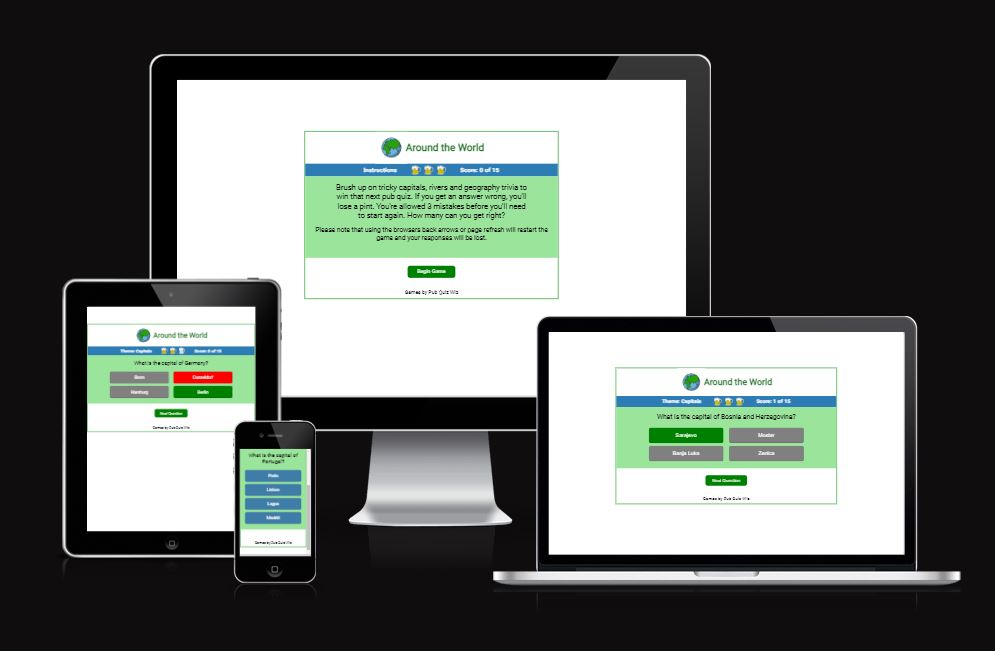

# Around the World Pub Quiz
## Introduction
This game has been created to fulfill Code Institute's Portfolio Project 2 course requirement. The course objective was to build an interactive front-end site using HTML, CSS and Javascript, which should allow users to interact with the site adn alter the way the site presents data.

As a product of the fictional company, "Pub Quiz Wiz, the goal of the quiz is to help players gain knowledge for that next pub quiz. I choose the theme of geography because it is a weak area for many people, as it is not a topic given limited focus in schools.
 

## Design
I planned the game using Balsamiq Wireframes.

I CAN NOT OPEN THIS APP!

## Features
### User Experience Goals & Feature Responses

#### Instructions
- Goal: The user only needs brief instructions to play the game. Play should be intuitive.
    - Response: The landing page has a set of brief instructions. 

#### Interaction
- Goal: The user should be certain of their selection.
    - Response: Hover properties were added to the button to confirm user selection.
- Goal: The user should get feedback if their selection was correct, and learn what the correct was correct.
    - Response: If a wrong answer is selected, the button turns red and the correct response turns green. A correct answer turns green. All buttons if neither wrong, nor selected, turn grey.  
- Goal: The user should know how many they have got wrong. 
    - In the score area, there are three pints of beer. If the user chooses the wrong answer, one of the beer mugs is replaced by an empty image. If a user gets three wrong answers, there is a timeout so the user has a chace to see the correct answer before the Game Over screen is displayed.
- Goal: The user should get a score.
    - A tally is kept at the top of the screen. The answer is given out of the total number of questions that will be asked. 

I originally had a number of feedback statements after the user selected make an answer selection. The people who tried my game thought it wasn't necessary. Either they stopped paying attention to it, didn't care about it one way or another, or found it distracting. I decided to delete it. 

#### Experience
- Goal: The game site should be easy to navigate.
    - Response: The start page has brief instructions and one button/choice, making it obvious how to start the game. The format of the question answer section is familiar as most games follow the same or similar format.
- Goal: The game should be challenging, as the objective is to learn something new, but not so challenging that it is impossible to get any questions correct.
- Goal: At the end of the game, users should feel that they want to play again. 
    - Response: Each game round is limited to 15 questions - five from each of the categories. It is not a big time commitment to play, and if the player gets a lot of wrong answers, they can be more quickly mastered.
- Goal: Users should have a variety of questions.
    - Response: There are 3 subject areas, which are capitals, rivers and general trivia. Five questions are presented after shuffling a greater number of questions in the category. 
- Goal: It shouldn't be possible to cheat by skipping questions. 
    - Response: The "Next Question" button is not visible on the question/anwer page until the user makes a selection. 

## Testing the game
### User Feedback
I have sent the game to people across a range of age groups. 
- 16-18: 4
- 20-30: 5
- 30-40: 3
- 50-60: 6
- 60 and over: 4

The game was most popular with young people who liked the challenge of it. They said they liked it because they had weak geography knowledge and the game allowed them to learn new facts. Older people gave me the impression they were embarrassed if they didn't know the answers.

Originally, the game had used all 10 questions per category, meaning there were a total of 30 questions. This was more a negative for people 30+. It was too much of a time commitment and too frustrating because a lot of the questions were perceived as difficult, especially the rivers. When reduced to 5 questions and shuffled, the player was able to learn the answers and progress through the themes. It also resulted in playeres wanting to play multiple times to get the satisfaction of getting a perfect score. Each time they played, they got some different questions. This made the game more interesting to repeat. 

When questioned whether there should be more easy questions, or if there should be a chance to get an extra try, the testers said no.  They liked the traditional three strikes and you're out model and felt that if that wasn't there, one would engage with the quiz passively and not remember the answers. 

Players liked the blue and green colors, matching the globe.

Players thought the game was intuitive.

Players thought the beer pints were fun.

Players liked the color changes to the answer buttons.

I sought out criticism, but did not get much. This will to some extent be done to testing the game on people I know. There was some debate over the answer to one question, which I have now removed. It was a question about the longest river in the world, with some sources saying the Nile and others the Amazon. 

I think perhaps the best and worst criticism I had is that it works like every other quiz they've tried on the internet. 

### Manual Testing

| Area | Target |Expected | Result |
| ---------------- |---------------- |---------------- | -----
|Header | Globe Gif | It should spin | True|
| Start page | Score area |The word "Instructions" is displaying | True |
| Start page | Score area |Beer pints should be full | True |
| Start page | Score area  |Score is 0 of 15 | True |
| Start page | Game area |The innstructions  on how to pay aredisplayed in question area | True |
| Start page | Game area | User Message displays, "How many can you get right at the start of game. | True |
|Start page|Under Game area|Begin Button hover properties work| True|
|Start page|Under Game area|Begin Button, when clicked, takes user to question page and hides| True|
|Score area|Theme|The word "instructions" should change to "Theme: Capitals"|False - it still says instructions. Fix 1|
|Score Area|Theme| The theme should change to rivers when questionIndex=5, and to trivia when questionIndex 6|True|
|Score Area|Pints|Pints change from full to empty when an answer is wrong.|True|
|Score Area|Score|The score increments with correct answers only.|True|
|Q & A Area|Question|Questions from the correct area are given|True|
|Q & A Area|Questions|The question are shuffled when game reloads|True|
|Q & A Area|Answers|The hover properties work.|True|
|Q & A Area|Answers|The answers match the related question.|True|
|Q & A Area|Answers|Correct answers display green, wrong answers display red, the other questions gray.|True|
|Q & A Area|Answers|When there are three wrong answers the game ends.|True|
|Q & A Area|Answers|After 3 wrong answers, the function pauses before moving to "game over," to give the user time to see the correct answer.|True|
|Game Over|User Message|If all answers are correct (15/15), user message reads, "Amazing result! Please be on my team"|True|
|Game Over|User Message|If wrongAnswer = 3, user message reads, "Game Over! Thanks for Playing"|True|
|Game Over|Start Over link|When clicked, the game refreshes and returns to the screen with instructions. |True|

Fixes:
1. Theme variable declared incorrectly, and although it worked in the GitPod development environment, the game then did not work when deployed on GitHub. After declaring the variable the game worked. 

EBIs (even better if)
- I wanted to add a window.beforeunload function, but learned that it was not possible to create a custom message, so I have changed the instructions instead. 
- As I went through the testing, I felt that there could be more types of user answers to match user end scores.

### Lighthouse
Lighthouse Destop results

Lighthouse Mobile results

Performance is slightly compromised by the rotating globe image. I followed the advice to convert it to webm and use a video tag. While I was able to do this successfully, by which I mean, it was uploaded and played automatically, it did not change the lighthouse score. At the same time, if you hovered over the webm file, you could see some properties which I didn't like. Based on my testers' experience of the game, I think this problem is not significant. The game loaded quickly on phones. 

The beer images were also listed as a problem. I had already used TinyPNG to compress them and I changed the height values to be explicit, but it did not change the Lighthouse result. 

## Technology
- Google Fonts
- Font Awesome
- W3C Markup Validation Service
- W3C CSS Validation Service - Jigsaw
- Lighthouse
- JSHint 
## Deployment

to be completed

## Credits/To be completed
- Daisy
### Javascript
- Web Dev Simplified
- The Fisher Yates shuffle
### Page Design
- Balsamiq Wireframes
- Course Materials
- CSS Tricks
### Images
- ShutterStock images
### General Resources
- W3 School
- Markdown Cheat Sheet - https://www.markdownguide.org/cheat-sheet/
